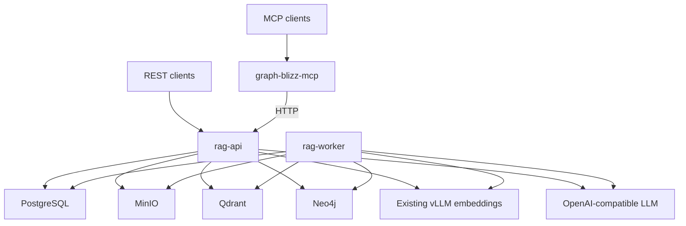

# Архитектура Graph Blizz — REST API и MCP

## 1. Назначение и текущее состояние

Graph Blizz — single-tenant Graph RAG-сервис для нескольких логически изолированных
workspace. Система загружает текстовые документы и исходный код, хранит оригиналы,
строит vector index и knowledge graph, а затем отвечает на вопросы с указанием
источников.

Базовый MVP уже реализован: создание workspace, асинхронная индексация, immutable
document revisions, update/delete/reindex, восстановление jobs после рестарта,
workspace isolation и Graph RAG query. Дальнейшая разработка не возвращается к
greenfield-плану, а развивает существующий REST API.

Ближайшая цель состоит из двух последовательных этапов:

1. завершить REST-контур: открыть Neo4j для работы с host, использовать внешний
   ранее развернутый vLLM embeddings endpoint и добавить список workspace с
   описаниями;
2. поверх стабильного REST API реализовать отдельный MCP server.

## 2. Архитектурные принципы

1. **Без авторизации.** Login, users, JWT, OIDC, API keys, RBAC, ACL, memberships и
   service accounts не входят ни в текущий этап, ни в утверждённый roadmap.
2. **Доверенный контур.** REST API, MCP server и опубликованные storage-порты
   разворачиваются только в доверенной сети. Публикация порта не превращает storage
   в публичный application API.
3. **REST API — единственная прикладная граница.** MCP server вызывает существующий
   HTTP API и не обращается напрямую к PostgreSQL, MinIO, Qdrant, Neo4j или
   LightRAG.
4. **Внешние model endpoints.** Graph Blizz не разворачивает embedding-модель.
   Embeddings и generation вызываются через настраиваемые OpenAI-compatible API.
5. **Изоляция workspace без пользовательских прав.** `workspace_id` определяет
   логическую область данных, а серверный `storage_key` — физические namespace.
   Клиент не может передать или изменить `storage_key`.
6. **Source of truth отделён от derived data.** PostgreSQL и MinIO содержат
   восстанавливаемые данные; Qdrant и Neo4j можно перестроить через reindex.
7. **Durable background processing.** Изменяющие индекс операции проходят через
   PostgreSQL jobs и `rag-worker`, а не выполняются внутри длительного HTTP request.

## 3. Что сознательно не входит в scope

- аутентификация и авторизация любого вида;
- управление пользователями, ролями и участниками workspace;
- встроенное развёртывание vLLM или иной embedding-модели;
- управление GPU, Hugging Face cache и model lifecycle;
- прямой доступ MCP server к внутренним storage;
- Kubernetes/Helm и публичный Internet deployment;
- multi-tenant security boundary между недоверенными пользователями.

Если сервис потребуется выставить в недоверенную сеть, защита должна быть добавлена
на инфраструктурном уровне отдельным решением. Это не является частью текущей
архитектуры и списка задач.

## 4. Контекст системы



`graph-blizz-mcp` появляется только после завершения текущего REST-этапа. До этого
все функции доступны через `rag-api` и Swagger/ReDoc.

## 5. Компоненты

### 5.1. `rag-api`

FastAPI-приложение предоставляет:

- health/readiness endpoints;
- create/get/list workspace;
- upload, upsert, list, get и delete document;
- enqueue workspace reindex;
- Graph RAG query с source metadata;
- OpenAPI contract для REST- и MCP-клиентов.

API валидирует входные данные, разрешает server-side workspace namespace,
сохраняет metadata и source, создаёт durable jobs и возвращает стабильную error
model. API не принимает identity credentials и не выполняет permission checks как
часть продуктового контракта.

В текущем коде могут сохраняться `DemoOwnerIdentityResolver`,
`DemoOwnerAccessPolicy` и `AuthorizedWorkspaceContext` как совместимый внутренний
adapter. Они не принимают credentials, не создают user tables и не являются
отдельной функцией авторизации; при дальнейшей чистке их можно заменить на простой
trusted-request context без изменения REST contract.

### 5.2. `rag-worker`

Worker получает jobs из PostgreSQL по lease-модели, обновляет heartbeat, выполняет
retry с ограничением числа попыток и завершает job только при действующем lease.
Он использует общий `IndexingService` и поддерживаемые операции LightRAG для
insert, replace, delete и reindex.

### 5.3. LightRAG runtime

Для workspace лениво создаётся runtime, физический namespace которого вычисляется
из серверного `storage_key` и текущей версии index contract. Runtime связывает:

- PostgreSQL-backed внутреннее состояние LightRAG;
- Qdrant vector storage;
- Neo4j graph storage;
- внешний embedding endpoint;
- внешний generation endpoint.

### 5.4. PostgreSQL

PostgreSQL хранит application metadata и workflow state:

- `workspaces`;
- `documents` и immutable `document_revisions`;
- durable indexing/delete/reindex jobs;
- parser/chunk/index versions и embedding profile identity.

Схема `graph_blizz` изменяется только версионируемыми Alembic migrations.

### 5.5. MinIO

MinIO хранит оригинальные байты каждой document revision. Source сохраняется до
индексации и остаётся доступным после ошибок, поэтому derived index можно
перестроить без повторной загрузки файла пользователем.

### 5.6. Qdrant

Qdrant хранит vector index, разделённый по versioned workspace namespace.
Приложение не предоставляет прокси к произвольным Qdrant operations.

### 5.7. Neo4j

Neo4j хранит knowledge graph LightRAG. Compose публикует оба стандартных интерфейса:

- HTTP Browser/API: `${GRAPH_BLIZZ_NEO4J_HTTP_PORT:-7474}:7474`;
- Bolt: `${GRAPH_BLIZZ_NEO4J_BOLT_PORT:-7687}:7687`.

`rag-api` и `rag-worker` продолжают использовать внутренний адрес
`bolt://neo4j:7687`. Опубликованные host-порты нужны для Neo4j Browser, диагностики
и ручных Cypher-запросов в доверенной среде. Пароль остаётся обязательным, но не
считается пользовательской авторизацией Graph Blizz.

### 5.8. Внешний vLLM embeddings endpoint

Embedding-модель уже развёрнута отдельно от Graph Blizz. В `docker-compose.yml` не
должно быть сервиса `vllm-embeddings`, GPU reservation, Hugging Face cache или
profile для запуска модели.

Оба процесса Graph Blizz используют одинаковые настройки:

- `GRAPH_BLIZZ_EMBEDDING__BASE_URL` — OpenAI-compatible base URL, включая `/v1`;
- `GRAPH_BLIZZ_EMBEDDING__MODEL` — имя модели на внешнем vLLM;
- `GRAPH_BLIZZ_EMBEDDING__DIMENSION` — ожидаемая размерность;
- `GRAPH_BLIZZ_EMBEDDING__API_KEY` — необязательный provider credential;
- `GRAPH_BLIZZ_EMBEDDING__TIMEOUT_SECONDS` — timeout вызова.

Для контейнеров endpoint передаётся через
`GRAPH_BLIZZ_COMPOSE_EMBEDDING_BASE_URL`. Значение по умолчанию не должно ссылаться
на удалённый Compose service. `scripts/init.sh` проверяет доступность настроенного
endpoint, но не пытается его запускать или загружать модель.

Изменение модели или dimension меняет embedding profile и требует reindex, чтобы
несовместимые vectors не смешивались в одном namespace.

### 5.9. Внешний LLM endpoint

Generation/extraction выполняются через настраиваемый OpenAI-compatible API.
Клиент содержит timeout, безопасное отображение provider errors и не логирует
prompts или полные responses.

## 6. Модель workspace

Workspace содержит:

| Поле | Назначение |
|---|---|
| `id` | Публичный UUID |
| `name` | Отображаемое имя |
| `slug` | Стабильный человекочитаемый идентификатор |
| `description` | Необязательное описание назначения и содержимого workspace |
| `storage_key` | Непубличный immutable physical namespace |
| `status` | `ACTIVE` или `ARCHIVED` |
| `index_schema_version` | Версия index contract |
| `embedding_profile` | Identity модели, dimension и normalization |
| `created_at`, `updated_at` | Временные метки |

`description` хранится в PostgreSQL, задаётся при создании workspace и возвращается
в публичных create/get/list responses. Пустое описание нормализуется в `null`;
рекомендуемый предел — 2000 символов.

### 6.1. Workspace list API

```http
GET /workspaces
```

Endpoint возвращает все workspace в детерминированном порядке
`created_at ASC, id ASC`. На первом этапе объём данных мал, поэтому ответ является
JSON-массивом. Параметры pagination добавляются только при подтверждённой
необходимости, без изменения полей элемента.

Пример ответа:

```json
[
  {
    "id": "12345678-1234-5678-1234-567812345678",
    "name": "Engineering",
    "slug": "engineering",
    "description": "Архитектура и исходный код продукта",
    "status": "ACTIVE",
    "created_at": "2026-09-24T10:00:00Z",
    "updated_at": "2026-09-24T10:00:00Z"
  }
]
```

`storage_key`, embedding profile и другие physical details не возвращаются.

## 7. Public REST API

| Метод и path | Назначение | Результат |
|---|---|---|
| `GET /health/live` | Liveness процесса | `200` без downstream checks |
| `GET /health/ready` | Готовность API | `200/503` |
| `POST /workspaces` | Создать workspace с `name`, `slug`, `description?` | Workspace metadata |
| `GET /workspaces` | Получить workspace с описаниями | Массив workspace |
| `GET /workspaces/{workspace_id}` | Получить один workspace | Workspace metadata |
| `POST /workspaces/{workspace_id}/maintenance/reindex` | Поставить reindex jobs | Job IDs |
| `GET /v1/jobs/{job_id}` | Получить публичный статус durable job | Job metadata |
| `POST /v1/workspaces/{workspace_id}/documents` | Загрузить новый document | Revision и job |
| `PUT /v1/workspaces/{workspace_id}/documents/{document_id}` | Идемпотентный upsert | Action, revision и job |
| `GET /v1/workspaces/{workspace_id}/documents` | Список documents | Metadata array |
| `GET /v1/workspaces/{workspace_id}/documents/{document_id}` | Metadata document | Document metadata |
| `DELETE /v1/workspaces/{workspace_id}/documents/{document_id}` | Асинхронное удаление | Delete job |
| `POST /v1/workspaces/{workspace_id}/query` | Graph RAG query | Answer, request ID, sources |

До MCP-этапа REST contract дополняется только необходимыми workspace list и
description полями. Существующие document/query paths и response semantics
сохраняются.

## 8. Основные потоки

### 8.1. Создание и чтение workspace

1. Клиент отправляет `name`, `slug` и необязательный `description`.
2. PostgreSQL генерирует UUID и immutable `storage_key`.
3. API возвращает только публичные поля.
4. List/get читают metadata без инициализации LightRAG runtime.

### 8.2. Загрузка и индексация документа

1. API проверяет workspace, имя файла, media type и размер.
2. Original source сохраняется в MinIO.
3. В одной PostgreSQL transaction создаются document/revision metadata и job.
4. API возвращает asynchronous result с `job_id`.
5. Worker получает lease, парсит source и вызывает LightRAG.
6. LightRAG получает embeddings из уже работающего внешнего vLLM.
7. После успешной записи Qdrant/Neo4j revision становится активной, а document —
   `READY`.

### 8.3. Query

1. API разрешает workspace по UUID и получает его server-side namespace.
2. LightRAG выполняет retrieval в workspace-specific Qdrant и Neo4j data.
3. Внешний LLM формирует ответ.
4. API возвращает `answer`, `workspace_id`, `request_id` и source metadata.

### 8.4. Reindex

1. API сравнивает сохранённый и активный index contract.
2. Несовместимые active revisions помечаются `requires_reindex`.
3. Создаются durable reindex jobs без дублирования уже активных jobs.
4. Worker восстанавливает derived data из PostgreSQL metadata и MinIO source.

## 9. Consistency и восстановление

- Create/update/delete/reindex используют durable jobs.
- Active revision переключается только после успешного завершения indexing.
- Ошибка новой revision не уничтожает предыдущую рабочую revision.
- Lease и attempt fencing не позволяют stale worker завершить чужую job.
- Повторная загрузка идентичного содержимого не создаёт новую revision.
- Потеря Qdrant/Neo4j устраняется reindex из PostgreSQL и MinIO.
- Смена embedding profile требует versioned namespace и reindex.

## 10. Docker Compose и сетевые границы

Compose управляет только application и data services:

- `rag-api`;
- `rag-worker`;
- PostgreSQL;
- MinIO;
- Qdrant;
- Neo4j.

Embedding vLLM и generation provider находятся за пределами Compose.

| Service | Host ports по умолчанию | Назначение |
|---|---:|---|
| `rag-api` | `8000` | REST, Swagger, ReDoc |
| MinIO | `9000`, `9001` | S3 API и Console |
| Qdrant | `6333` | Dashboard/API для диагностики |
| Neo4j | `7474`, `7687` | Browser/HTTP и Bolt |
| PostgreSQL | не публикуется | Только internal network |
| External vLLM | не управляется проектом | Задаётся configuration |

Порты переопределяются environment variables. Neo4j, MinIO и Qdrant доступны с
host только для работы в доверенной среде. В production-like окружении exposure
регулируется network/firewall configuration вне Graph Blizz.

## 11. Observability и безопасное логирование

Structured logs содержат `request_id`, `service`, `workspace_id`, `document_id`,
`operation`, `duration_ms` и `result`. В логи не попадают:

- provider credentials;
- document content;
- embeddings;
- prompts и полные model responses;
- MinIO object secrets;
- внутренний `storage_key` в публичном HTTP-контексте.

Ошибки внешних model endpoints отображаются в стабильные application errors без
утечки provider response bodies.

## 12. MCP над существующим API

### 12.1. Граница MCP

MCP реализуется отдельным процессом/пакетом `graph-blizz-mcp`. Он использует
настраиваемый `GRAPH_BLIZZ_API_BASE_URL` и вызывает только документированные REST
endpoints. Это сохраняет единые validation, job semantics, workspace resolution,
logging и error mapping для HTTP и MCP клиентов.

MCP server не импортирует repositories, storage adapters или LightRAG runtime из
`rag-api` и не имеет credentials PostgreSQL/MinIO/Qdrant/Neo4j.

### 12.2. Первая версия MCP tools

| MCP tool | REST API |
|---|---|
| `list_workspaces` | `GET /workspaces` |
| `get_workspace` | `GET /workspaces/{workspace_id}` |
| `list_documents` | `GET /v1/workspaces/{workspace_id}/documents` |
| `get_document` | `GET /v1/workspaces/{workspace_id}/documents/{document_id}` |
| `query_workspace` | `POST /v1/workspaces/{workspace_id}/query` |
| `upload_document` | `POST /v1/workspaces/{workspace_id}/documents` |
| `upsert_document` | `PUT /v1/workspaces/{workspace_id}/documents/{document_id}` |
| `delete_document` | `DELETE /v1/workspaces/{workspace_id}/documents/{document_id}` |
| `reindex_workspace` | `POST /workspaces/{workspace_id}/maintenance/reindex` |

Первая поставка начинает с read/query tools, затем добавляет mutating tools.
Long-running operations возвращают `job_id` и текущее состояние, а MCP server не
держит соединение до окончания indexing.

### 12.3. MCP transport и ошибки

- основной transport для локальной интеграции — `stdio`;
- Streamable HTTP может быть добавлен позже без изменения tool contracts;
- validation errors REST преобразуются в понятные MCP tool errors;
- `404`, `409`, `413`, `415`, `502` и `503` не маскируются как успешный result;
- timeout MCP HTTP client ограничен и конфигурируется;
- tool responses содержат только публичные REST fields.

## 13. План этапов

### Этап A — завершение REST-контура

1. Опубликовать Neo4j HTTP и Bolt ports и обновить диагностику.
2. Удалить встроенный Compose vLLM и перевести init/tests/docs на обязательный
   внешний embedding endpoint.
3. Добавить `workspaces.description`, `GET /workspaces` и согласованные create/get
   responses.
4. Добавить публичный `GET /v1/jobs/{job_id}` для polling asynchronous operations.
5. Подтвердить полный REST lifecycle с внешним embedding contract stub или
   доступным vLLM.

### Этап B — MCP поверх REST

1. Создать типизированный async HTTP client к текущему API.
2. Реализовать `list/get/query` MCP tools.
3. Реализовать document mutation и reindex tools.
4. Добавить MCP contract/integration tests, packaging и инструкции запуска.

### Этап C — дальнейшая эксплуатационная устойчивость

После MCP допустимы disaster-recovery tests, metrics/tracing и deployment
hardening. Добавление auth не является частью этого этапа.

## 14. Критерии завершения

### REST-ready

- Neo4j Browser доступен на configurable host HTTP port, Bolt — на configurable
  host Bolt port;
- Compose не содержит embedding model service, GPU reservation или model cache;
- `rag-api` и `rag-worker` используют один внешний embeddings configuration;
- workspace можно создать с description и получить в `GET /workspaces`;
- существующий document lifecycle и query проходят regression suite;
- API работает без credentials/Authorization header.

### MCP-ready

- MCP client получает список workspace и их описания;
- MCP client выполняет Graph RAG query и получает те же sources, что REST client;
- document mutations возвращают REST-derived revision/job metadata;
- MCP не подключается к storage напрямую;
- ошибки и timeouts проверены contract tests;
- локальный запуск MCP задокументирован одной воспроизводимой командой.

## 15. Architecture decisions

Существующие ADR фиксируют уже реализованные решения MVP. ADR о DemoOwner описывает
историческую внутреннюю совместимость текущего кода, но не создаёт будущую задачу
на OIDC/RBAC. Новые решения должны быть зафиксированы отдельными ADR:

- публикация Neo4j HTTP/Bolt ports в доверенном deployment;
- внешний embeddings endpoint без lifecycle модели в Graph Blizz;
- workspace description и list contract;
- MCP как HTTP adapter над REST API.
